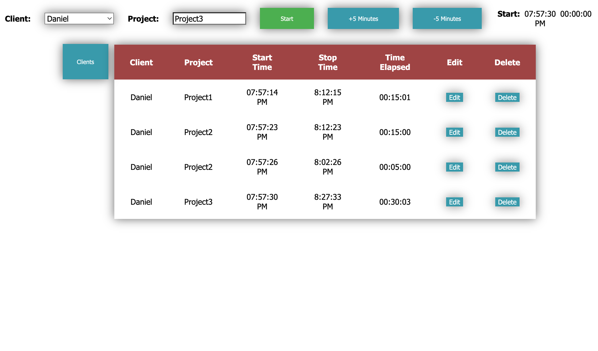

<a name="readme-top"></a>

[](https://GitHub.com/Naereen/StrapDown.js/graphs/commit-activity)


<!-- TABLE OF CONTENTS -->
<details>
  <summary>Table of Contents</summary>
  <ol>
    <li>
      <a href="#about-the-project">About The Project</a>
      <ul>
        <li><a href="#built-with">Built With</a></li>
      </ul>
    </li>
    <li>
      <a href="#getting-started">Getting Started</a>
      <ul>
        <li><a href="#prerequisites">Prerequisites</a></li>
      </ul>
    </li>
    <li><<a href="#installation">Installation</a></li>
  </ol>
</details>


<!-- ABOUT THE PROJECT -->
## Clients Time Tracker



This project is a React application designed to simulate a business tracking the time it spends with a client for what project they were working on and be able to edit and delete the sessions the business have with the client.


<p align="right">(<a href="#readme-top">back to top</a>)</p>


### Built With

Languages:
* Javascript
* CSS

Frameworks:
* React


<p align="right">(<a href="#readme-top">back to top</a>)</p>


<!-- GETTING STARTED -->
## Getting Started

Make sure to have `npm install` packages configured and then just run `npm start` or `docker-compose -f docker-compose.yml up`. You first need to configure a client with a name in order to use the time tracker web application.

### Installation

1. Clone the repo
  ```sh
  git clone https://github.com/dnnysoftware/ClientTimeTracker.git
  ```
2. Make sure to have dependencies installed
3. Start the application
  ```sh
  npm start
  ``` 
4. Or you can run the docker container
    ```sh
    docker-compose -f docker-compose.yml up
    ``` 

<p align="right">(<a href="#readme-top">back to top</a>)</p>